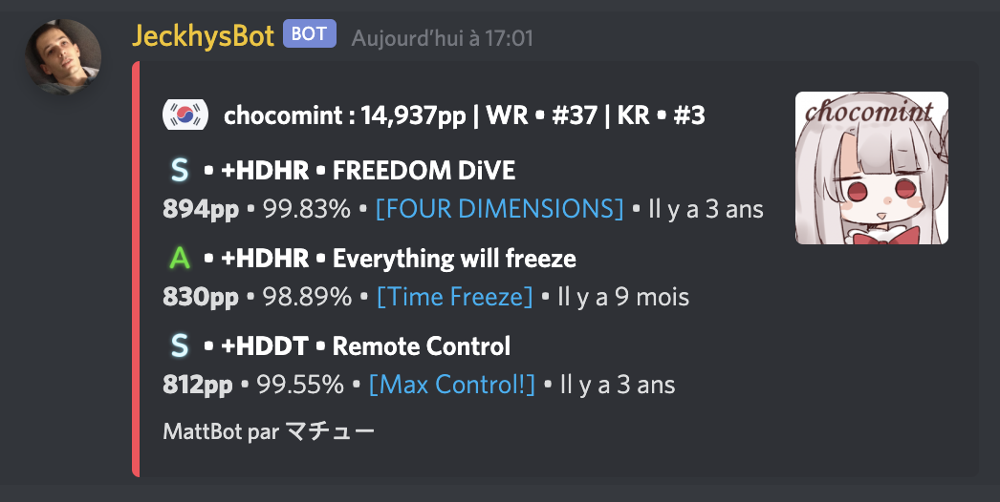
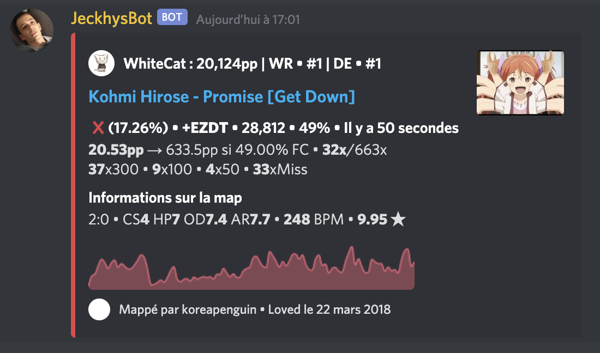

MachuBot is a multipurpose Discord bot written using Typescript.

## Features

-  /ping command => Displays the latency of the bot
-  /status command => Displays the status of the API the bot is using
-  /osu command
   -  /osu best **[username]** **[1..50]** => Displays the best scores for user (default to
      yourself)
   -  /osu recent **[username]** **[1..50]** => Displays the most recent score for user (default to
      yourself)
   -  /osu associate **<username>** => Associates your osu!
-  /crypto command
   -  /crypto market => Displays the current market value of cryptocurrencies
   -  /crypto coin **<crypto>** **[currency]** => Displays the current value of a cryptocurrency
      (default to USD)
-  /survey command
   -  /survey create **<question>** **<answers>** => Creates a survey with a question and answers
      (comma separated)

## Screenshots and preview

`!ob chocomint`

`!or WhiteCat`

